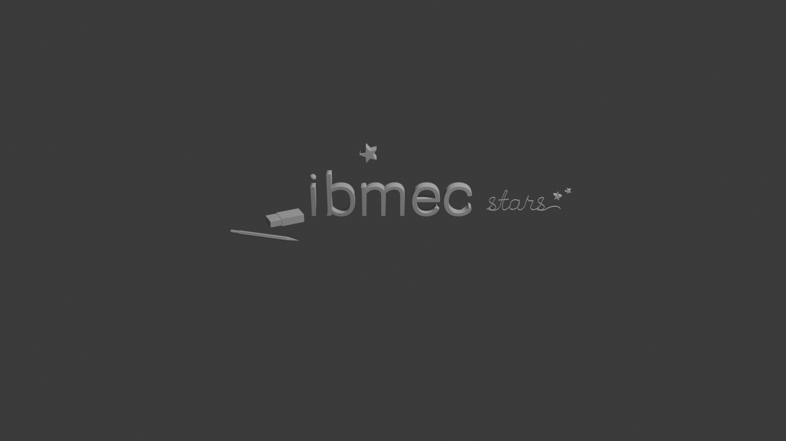
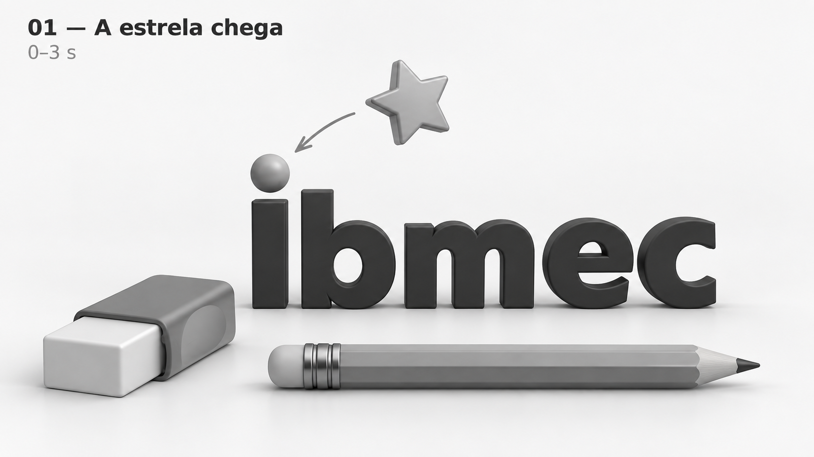
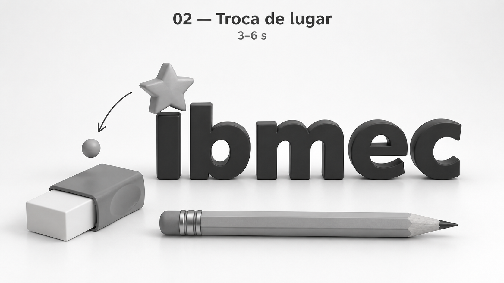
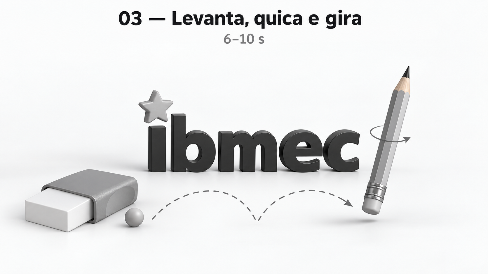
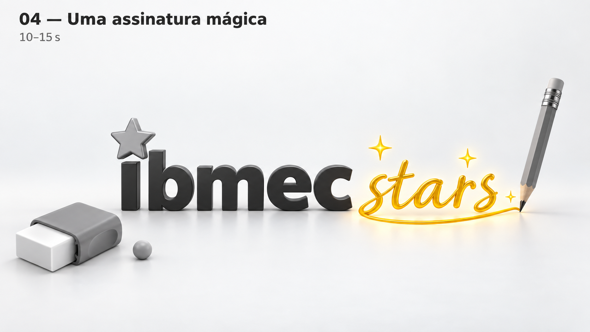

# AP1 — Ibmec: uma ideia vira estrela

**Aluno(a):** Marceu Veiga de Almeida Filho  
**Matrícula:** 202051772191 
**Curso / Turma:** Engenharia de software 
**Versão do Software:** Blender 4.5 LTS  
**Nome do Arquivo .blend:** [AP1_MarceuFilho.blend](AP1_MarceuFilho.blend)

## Parte 1 — Relatório curto

### 1. Título da peça e conceito geral

**Título:** Ibmec Stars: uma ideia vira estrela.

**Conceito visual:** Uma estrela, uma borracha e um lápis dão vida à palavra Ibmec. A cena liga o aprendizado à criatividade, à construção de ideias e à inovação. A marca é o elemento principal.

### 2. Narrativa e destaque da marca Ibmec

**Apresentação da marca:** A palavra aparece em 3D, com a fonte Krub Regular e um ponto redondo separado sobre o “i”. Os objetos ficam ao redor, sem impedir sua leitura.

**Ideia de transformação:** A estrela chega e ocupa o lugar do ponto do “i”. O ponto cai perto da borracha. O lápis levanta, quica sobre sua própria borracha e gira. Depois, escreve “stars” ao lado de Ibmec, formando a composição final.

### 3. Os três objetos autorais

| Objeto | Função na cena | Modo de construção |
| --- | --- | --- |
| **Estrela — `Obj_Estrela`** | Inicia a transformação ao ocupar o lugar do ponto do “i”. Representa uma nova ideia. | Círculo de 10 vértices, alternando pontas externas e internas, com preenchimento, extrusão e Bevel. |
| **Borracha — `Borracha_Corpo` e `Borracha_Capa`** | Compõe o ambiente de estudo e marca o local onde o ponto cai. Representa a possibilidade de corrigir e tentar de novo. | Dois cubos ajustados. A capa tem as extremidades abertas, Solidify e Bevel. |
| **Lápis — `Lapis_Corpo` e suas quatro peças** | Levanta e escreve “stars”. Representa a criação e a construção de ideias. | Cilindro de seis lados, cones para madeira e grafite, cilindros para ferrule e borracha, com Bevel na borracha. |

Os três modelos foram construídos no Blender a partir de geometria básica, sem modelos baixados. O ponto, o lettering e as duas cópias decorativas da estrela são elementos auxiliares. As peças do lápis e da borracha formam dois conjuntos, não objetos autorais separados.

### 4. Técnicas de modelagem e transformações geométricas

**Técnicas:** Extrusão, edição de vértices e faces, Bevel, Solidify e curvas Bézier com espessura. A palavra “stars” foi desenhada com curvas editáveis, sem usar uma fonte.

**Transformações:** Foram usados deslocamento, rotação e ajuste de tamanho para organizar a composição. A estrela ficou acima da palavra; lápis e borracha ficaram apoiados no chão. As peças de cada conjunto foram ligadas ao corpo por parentesco.

### 5. Organização técnica da cena

**Coleções:** `AP1_Ibmec_Conceito` contém `marca` e `objetos_autorais`. A primeira reúne os textos e o ponto; a segunda reúne os três modelos e as estrelas decorativas. Câmera e luz ainda estão na coleção `Collection`.

**Câmera:** A câmera existente, `Camera`, apresenta a composição em perspectiva. O enquadramento ainda pode ser aproximado para destacar melhor a marca.

**Duração planejada:** 15 segundos, a 24 fps, totalizando 360 frames. 

**Estado da AP1:** Modelagem em cinza, sem animação. Todos os objetos estão visíveis para inspeção, inclusive os elementos previstos para o encerramento.

### 6. Plano resumido para a AP2

- Animar a chegada da estrela e a queda do ponto.
- Animar o lápis levantando, quicando sobre sua borracha, girando e escrevendo.
- Revelar “stars” e as duas estrelas decorativas somente no encerramento.
- Finalizar câmera, iluminação, materiais e o brilho da assinatura, preservando a leitura da marca.
- Renderizar e exportar o vídeo de 15 segundos no Eevee.

### Imagem da cena modelada

## Parte 2 — Storyboard de 15 segundos

As quatro imagens abaixo representam o planejamento da AP2. As poses, cores e efeitos finais ainda serão desenvolvidos.

### Quadro 1 — A estrela chega

**0–3 segundos | Frames 1–72**

- **Ação:** A estrela desce na direção do ponto do “i”. Lápis e borracha estão no chão.
- **Destaque:** A palavra Ibmec e a aproximação da estrela.
- **Foco visual:** Apresentar a cena e criar expectativa.

### Quadro 2 — Troca de lugar

**3–6 segundos | Frames 73–144**

- **Ação:** A estrela ocupa o lugar do ponto, que cai em direção à borracha.
- **Destaque:** A transformação sobre o “i”.
- **Foco visual:** Mostrar a troca sem perder a leitura da marca.

### Quadro 3 — Levanta, quica e gira

**6–10 segundos | Frames 145–240**

- **Ação:** O lápis levanta, quica sobre sua própria borracha e gira até se preparar para escrever. O ponto fica perto da borracha separada.
- **Destaque:** O movimento do lápis, com Ibmec visível ao fundo.
- **Foco visual:** Dar vida ao objeto e preparar a assinatura.

### Quadro 4 — Uma assinatura mágica

**10–15 segundos | Frames 241–360**

- **Ação:** O lápis escreve “stars” em cursivo, faz um pequeno traço final e surgem duas estrelas decorativas.
- **Destaque:** A composição “ibmec stars”, com Ibmec como foco principal.
- **Foco visual:** Finalizar com brilho na assinatura e uma pausa para leitura.
